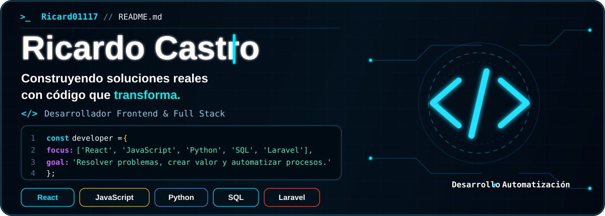

# Hola, soy Ricardo Castro 

 

### Desarrollador Full Stack
**Desarrollo • Automatización • Soluciones reales**

 

---

## 👨‍💻 Sobre mí

- Desarrollo aplicaciones web con **React, JavaScript, Python, SQL y Laravel**.
- Trabajo en proyectos orientados a resolver necesidades reales.
- Desarrollo soluciones para **automatización de procesos**.
- Experiencia trabajando con **Odoo y soluciones empresariales**.
- Me interesa seguir fortaleciendo mis conocimientos en desarrollo Full Stack.

---

## 🛠 Tecnologías

 

---

## 🚀 Proyectos destacados

<table>
<tr>

<td width="50%">

### 🎓 Plataforma Académica

Plataforma académica desarrollada para gestión, publicación y consulta de contenido académico.

**Tecnologías:** React · Laravel · MySQL

[Ver repositorio](https://github.com/Ricard01117/plataforma-academica)

</td>

<td width="50%">

### 📦 Sistema de Inventario

Interfaz para gestión de productos, categorías, existencias y operaciones de inventario.

**Tecnologías:** React · Vite · JavaScript

[Ver repositorio](https://github.com/Ricard01117/sistema-inventario-frontend)

</td>

</tr>

<tr>

<td width="50%">

### 🎨 Artesanías de mi mamá

Sitio web diseñado para presentar y compartir una colección de artesanías mediante galería multimedia.

**Tecnologías:** HTML · CSS · JavaScript

[Ver repositorio](https://github.com/Ricard01117/artesanias-de-mi-mama)

</td>

<td width="50%">

### 🎮 Buscador de videojuegos

Aplicación para buscar videojuegos mediante una API externa y mostrar resultados dinámicamente.

**Tecnologías:** React · Vite · API

[Ver repositorio](https://github.com/Ricard01117/Buscador-de-juegos)

</td>

</tr>
</table>

---

## 📊 Actividad en GitHub

 

---

### `> código • disciplina • constancia _`

